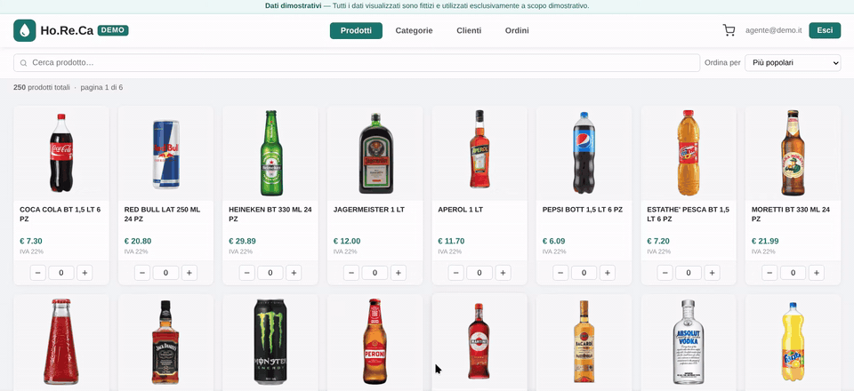
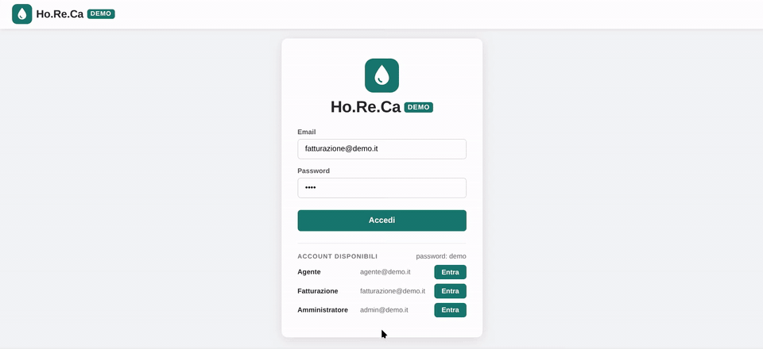
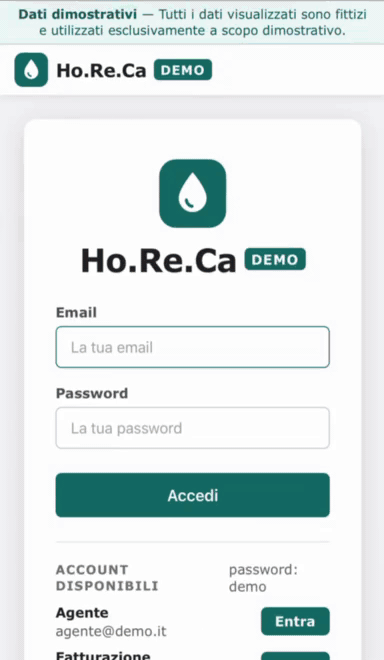

# Ho.Re.Ca — B2B ordering platform for a sales force

A web app that lets a beverage wholesaler's sales agents take orders from their Ho.Re.Ca.
customers (hotels, restaurants, cafés), and lets the billing office process them into the
company's ERP. It is in daily production use by the agents and the billing office of an
Italian beverage distributor; this is a public demo of it, running on fictional data.

**▶ Live demo: [horeca-demo.onrender.com](https://horeca-demo.onrender.com)**

| Role | Email | Password |
|---|---|---|
| Sales agent | `agente@demo.it` | `demo` |
| Billing | `fatturazione@demo.it` | `demo` |
| Administrator | `admin@demo.it` | `demo` |

The login page also has a one-click **Entra** ("Sign in") button for each account.
The interface is in Italian, as it is for its real users.

---

## What it does

An agent browses the catalogue, fills a cart for one of their customers and sends the order.
Billing picks it up, downloads it as a CSV the ERP imports directly, and marks it as
fulfilled once invoiced.

### Catalogue and search

- 250 products in 20 categories, with photos, VAT rate and description.
- Search results update as you type, backed by a PostgreSQL trigram index, so matching
  anywhere in a product name stays fast.
- Sort by popularity, price or name, in the whole catalogue or inside a category.

### Cart and orders (sales agent)

- The cart keeps the order in which products were added, and the unsent customer and
  notes survive navigation between pages.
- Each agent only sees their own customers and orders; an optional transport fee can be
  added to the order.
- Orders can be searched by customer or product, and deleted while they are still unprocessed.

### Fulfilment (billing)

- Orders from every agent, in one tab per status: sent, in progress, fulfilled.
- Downloading the CSV moves the order to *in progress*; marking it fulfilled closes it.

### Mobile and dark mode

### Administration

- User list with roles (agent, billing, administrator) and password changes.

---

## About the demo

- Customers, users, orders and prices are fictional. The products (names and photos of
  well-known brands) come from a real distributor's catalogue.
- Every deploy rebuilds the database from scratch, so the demo always starts clean.
- Password changes are disabled in the demo (shown greyed out), so that the demo accounts
  keep working for everyone.
